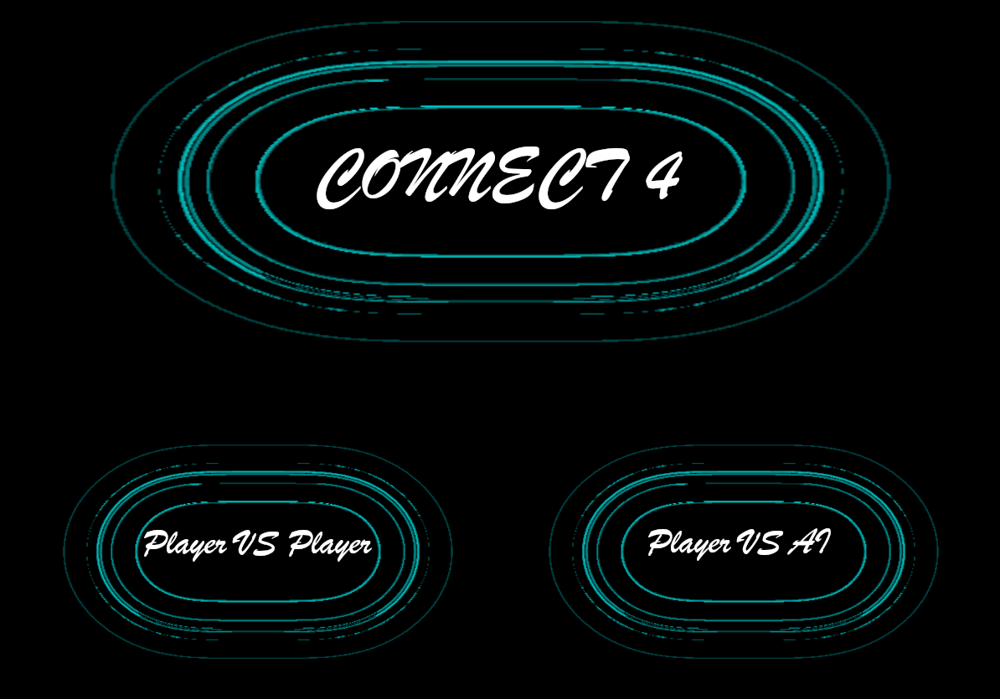
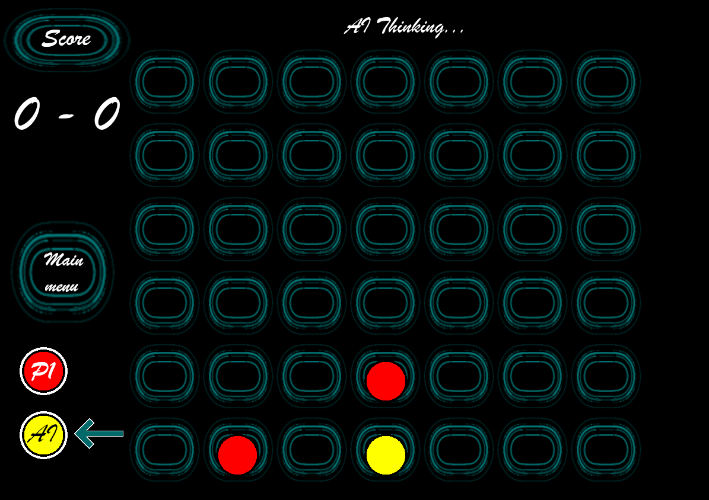
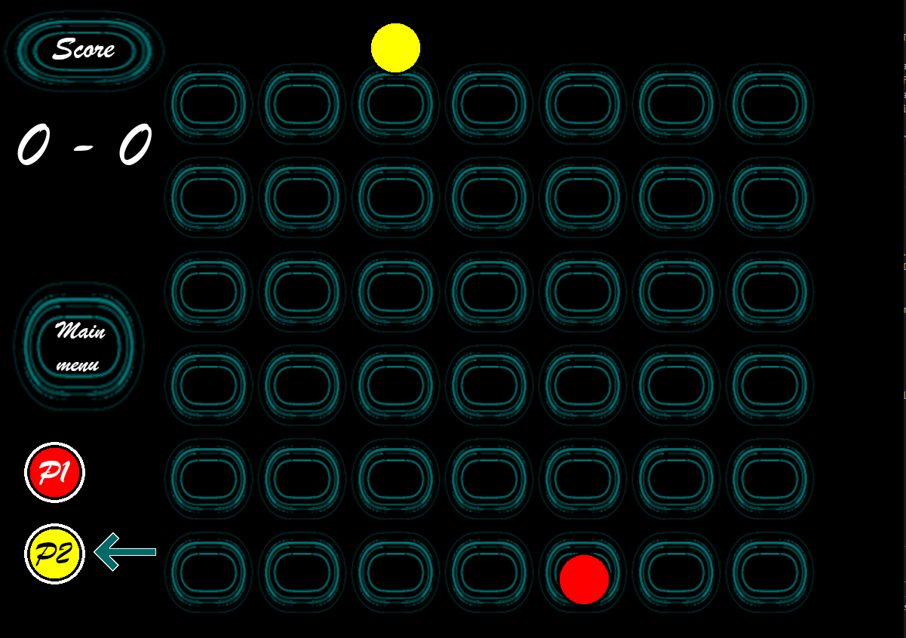

# Connect 4 with Monte Carlo Tree Search

## 🎯 Project Overview
This project implements the classic **Connect 4 game**, with:

- **Graphical User Interface (GUI):** An interactive and user-friendly design to play the game.  
- **AI Opponent (MCTS):** A Monte Carlo Tree Search algorithm that makes strategic decisions, providing a challenging gameplay experience.  

The goal is to demonstrate the integration of **game logic** and **artificial intelligence techniques** to better understand Monte Carlo methods.

---

## 🧠 How the AI Works (MCTS)
Monte Carlo Tree Search (MCTS) is used as the decision-making algorithm:

- **Selection:** Traverse the game tree using UCT (Upper Confidence Bound for Trees).  
- **Expansion:** Add new nodes for unexplored moves.  
- **Simulation:** Play random games until reaching a terminal state.  
- **Backpropagation:** Update win/visit counts for all visited nodes.  

This process balances **exploration** (trying new moves) and **exploitation** (choosing moves that worked in the past).

---

## 📂Files content:

**< Connect-4.py >**  
&nbsp;&nbsp;&nbsp;&nbsp;Graphic version to play  
&nbsp;&nbsp;&nbsp;&nbsp;Can play PvP or PvAI (AI plays using MCTS algorithm limited to 5 seconds)  

**< Game4InLine.py >**  
&nbsp;&nbsp;&nbsp;&nbsp;Game logic and A* implementation  

**< MCTS.py >**  
&nbsp;&nbsp;&nbsp;&nbsp;Monte Carlo Tree Search implementation  

**< play.py >**  
&nbsp;&nbsp;&nbsp;&nbsp;Terminal interface to play (and view the AI choices with values for each possible play): (5 options)  
&nbsp;&nbsp;&nbsp;&nbsp;&nbsp;&nbsp;&nbsp;&nbsp;1: Human vs Human | or | Human vs AI (you can choose which AI to face, among A* and MCTS)  
&nbsp;&nbsp;&nbsp;&nbsp;&nbsp;&nbsp;&nbsp;&nbsp;2: A* vs A*  
&nbsp;&nbsp;&nbsp;&nbsp;&nbsp;&nbsp;&nbsp;&nbsp;3: MCTS vs MCTS  
&nbsp;&nbsp;&nbsp;&nbsp;&nbsp;&nbsp;&nbsp;&nbsp;4: A* vs MCTS  
&nbsp;&nbsp;&nbsp;&nbsp;&nbsp;&nbsp;&nbsp;&nbsp;5: MCTS vs A*  

---

## 🛠️ Installation & Setup

```bash
Clone the repository:
git clone https://github.com/joaobaptista30/AI-4_connected.git
cd AI-4_connected

# Install dependencies:
pip install -r requirements.txt

# Run the game with UI:
python Connect-4.py

# Run on terminal to view AI thoughts at each turn:
python play.py
```

---

## 📸 Screenshots

  
  

